# World Cup 2026 Event-Driven Tournament Lakehouse

This project is a local-first football data platform that proves a full architecture from source ingestion to serving. It reads sample files, downloaded public datasets, and optional live API payloads, then converts them into an immutable event log, canonical tournament tables, tournament state, marts, a Streamlit dashboard, and a FastAPI layer.

Run the full pipeline with:

```bash
python run_pipeline.py
```

## Architecture

```text
External Sources
-> Ingestion Layer
-> Immutable Tournament Event Log
-> Canonical Tournament Data Model
-> Tournament Rules & State Engine
-> Analytics Marts
-> Serving Layer
```

End-to-end architecture diagram:

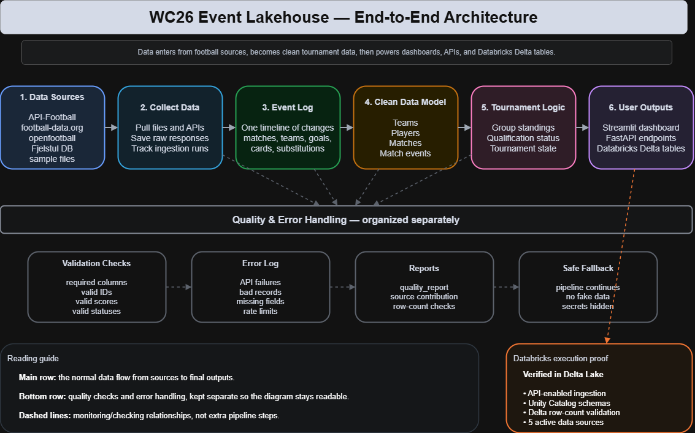

This is not just a raw-ingestion project. Each layer writes real outputs.

## Execution proof

This project has been executed locally and on Databricks.

### Databricks Delta execution

The pipeline was executed on Databricks with API-enabled ingestion using Databricks secrets. Delta tables were written under Unity Catalog and validated through SQL row-count checks.

| Delta table | Rows |
|---|---:|
| `wc26_lakehouse.event_log.event_log` | 13,399 |
| `wc26_lakehouse.canonical.fact_match` | 1,523 |
| `wc26_lakehouse.state.state_group_standings` | 656 |
| `wc26_lakehouse.marts.mart_match_center` | 1,523 |
| `wc26_lakehouse.quality.source_contribution_report` | 5 |

Source contribution validation:

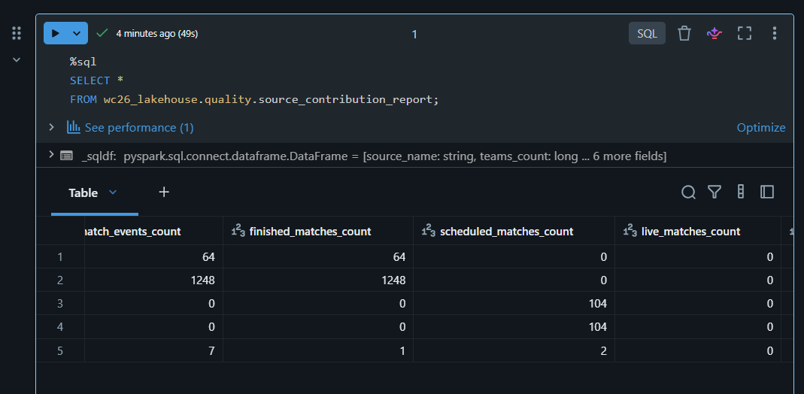

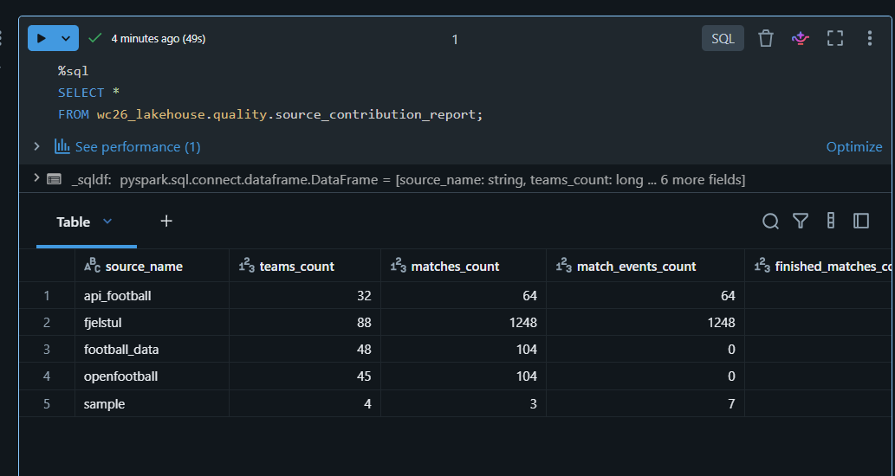

Delta row-count validation:

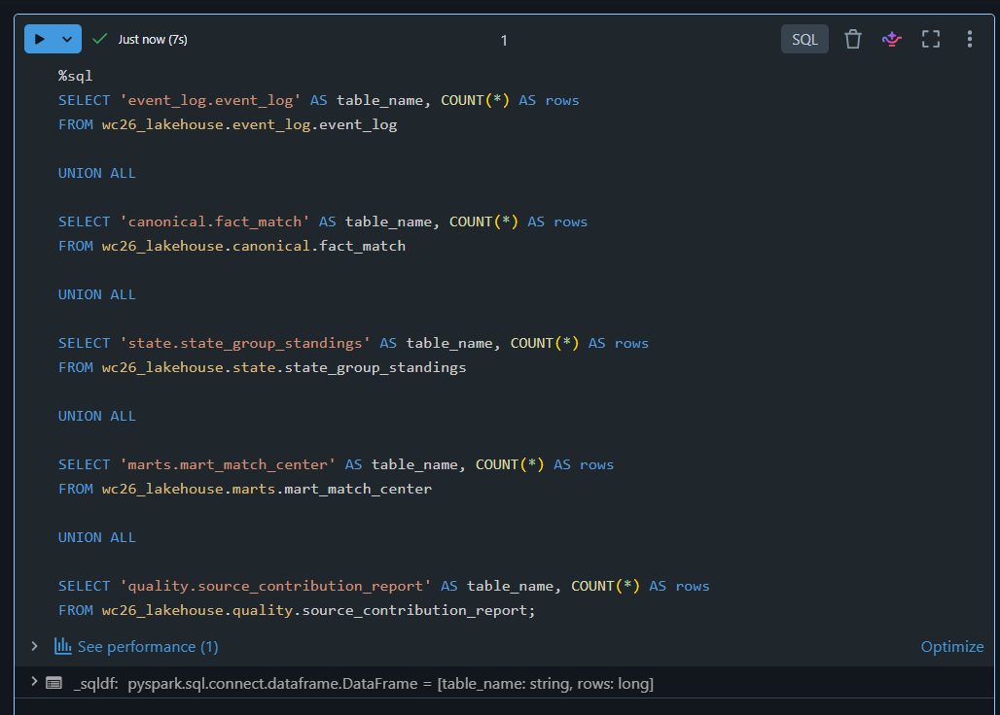

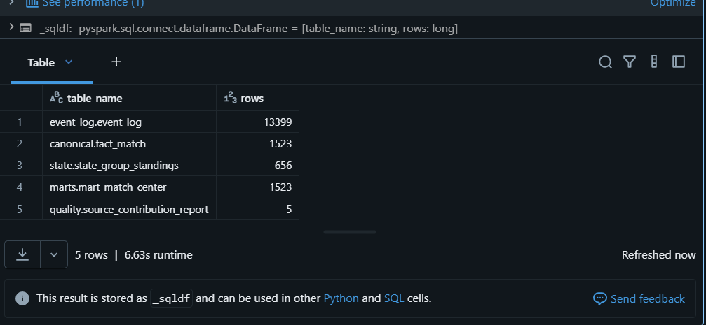

Unity Catalog and marts preview:

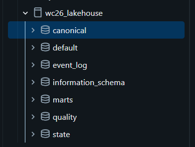

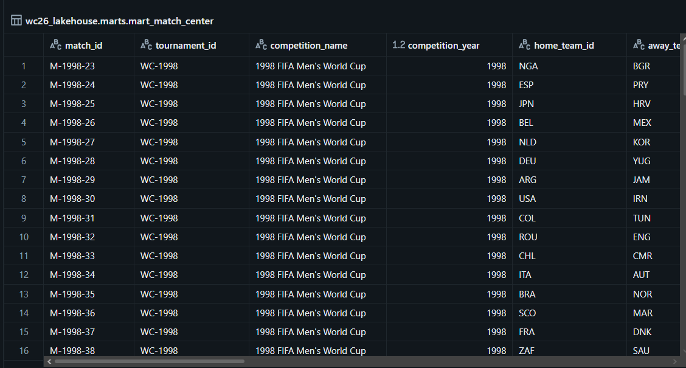

### Streamlit dashboard

The Streamlit dashboard serves tournament analytics, source contribution, standings, match center, team performance, and quality checks from processed project outputs.

```powershell
.\scripts\run_dashboard.ps1
```

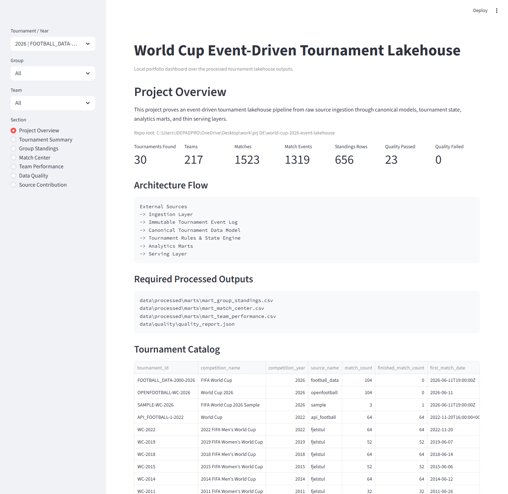

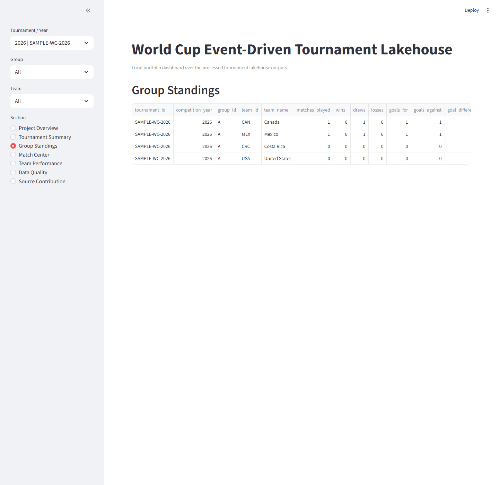

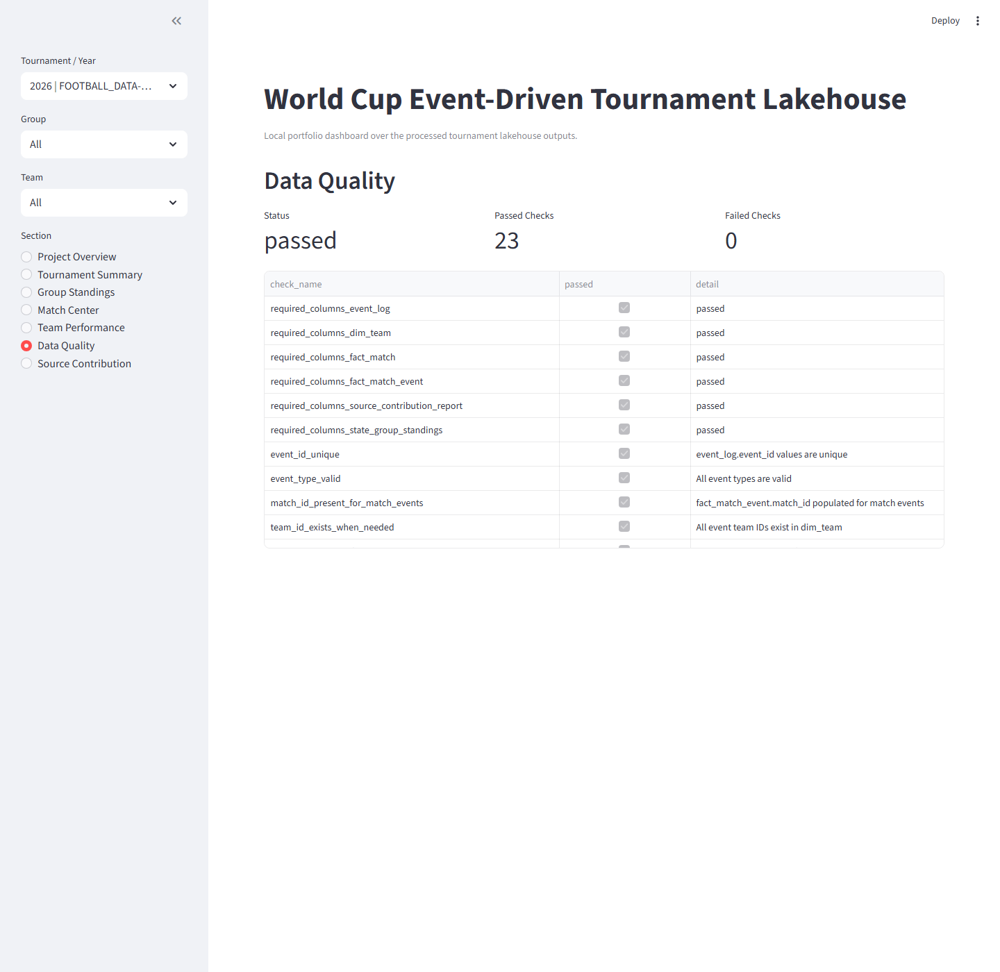

### FastAPI serving layer

The FastAPI app exposes health, summary, tournament, standings, match, team, and quality endpoints over the processed serving outputs, with Swagger docs available for interactive exploration.

```powershell
.\scripts\run_api.ps1
```

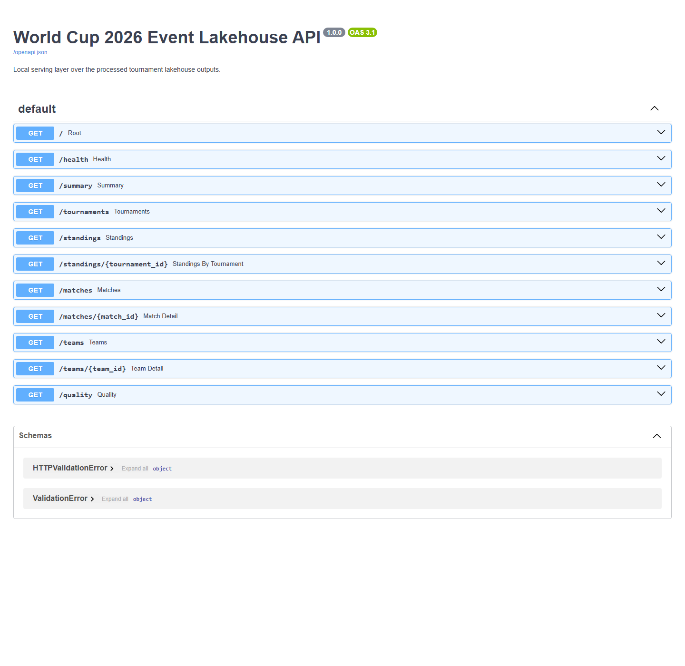

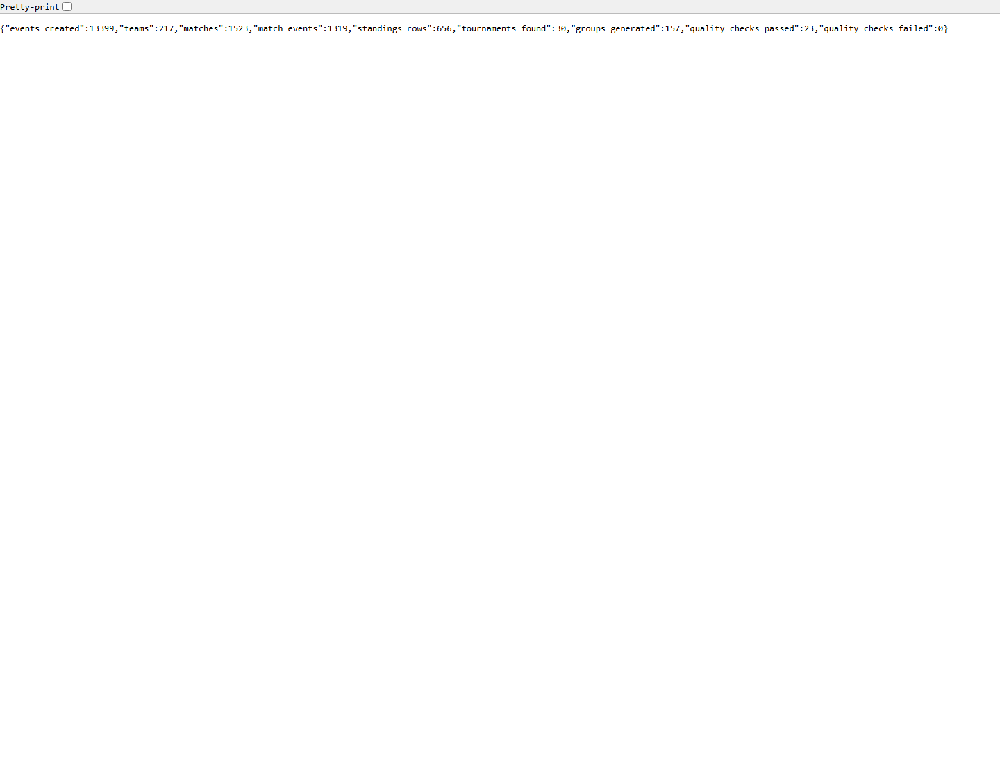

## Data Sources

Current source coverage:

- `data/sample/` for controlled 2026 MVP testing
- `data/external/openfootball/` for public tournament structure
- `data/external/fjelstul/` for historical World Cup data
- `data/raw/api_football/` for raw API-Football payloads
- `data/raw/football_data/` for raw football-data.org payloads

The API sources now contribute normalized canonical records as well as preserved raw JSON.

## Security

API keys must stay in local `.env`, never in `data/raw/`.

- `.env` is ignored by Git.
- `.env.example` contains placeholders only.
- raw API JSON is allowed under `data/raw/`.
- secret text files are not allowed under `data/raw/`.

If a real API key was ever committed to GitHub, rotate it immediately.

Example local `.env`:

```env
API_FOOTBALL_KEY=your_api_football_key_here
FOOTBALL_DATA_KEY=your_football_data_key_here
```

## Quick Start

From the repo root:

```bash
python -m pip install -r requirements.txt
Copy-Item .env.example .env
python run_pipeline.py
```

Databricks credentials are not required for local runs or tests.

## Local Serving

Windows setup:

```powershell
.\scripts\setup_windows.ps1
```

Run dashboard:

```powershell
.\scripts\run_dashboard.ps1
```

Run API:

```powershell
.\scripts\run_api.ps1
```

Manual equivalents:

```bash
python -m streamlit run dashboard/streamlit_app.py
python -m uvicorn api.main:app --reload
```

Using `python -m streamlit` avoids Windows PATH issues when the `streamlit` command is not available globally.

URLs:

- Streamlit: `http://localhost:8501`
- FastAPI docs: `http://127.0.0.1:8000/docs`
- FastAPI summary: `http://127.0.0.1:8000/summary`

## Pipeline Outputs

One successful run writes:

- `data/processed/event_log/event_log.csv`
- `data/processed/canonical/dim_team.csv`
- `data/processed/canonical/dim_player.csv`
- `data/processed/canonical/fact_match.csv`
- `data/processed/canonical/fact_match_event.csv`
- `data/processed/state/state_group_standings.csv`
- `data/processed/state/state_qualification_status.csv`
- `data/processed/marts/mart_group_standings.csv`
- `data/processed/marts/mart_match_center.csv`
- `data/processed/marts/mart_team_performance.csv`
- `data/quality/quality_report.json`
- `data/quality/source_contribution_report.csv`

## Databricks / Delta Path

The repo now has a Databricks-ready execution path that preserves the local file-based MVP.

Local MVP:

- keeps CSV and JSON outputs under `data/processed/` and `data/quality/`

Databricks version:

- maps those outputs to Delta tables under Unity Catalog
- uses `configs/databricks.yml` for catalog/schema/table naming
- uses `scripts/write_delta_tables.py` as the local-to-Delta export entrypoint
- uses Databricks Workflows and notebook tasks under `databricks/`

Direct mapping:

- `data/processed/event_log/event_log.csv` -> `wc26_lakehouse.event_log.event_log`
- `data/processed/canonical/*.csv` -> `wc26_lakehouse.canonical.*`
- `data/processed/state/*.csv` -> `wc26_lakehouse.state.*`
- `data/processed/marts/*.csv` -> `wc26_lakehouse.marts.*`
- `data/quality/*.csv|json` -> `wc26_lakehouse.quality.*`

Local-safe Delta write command:

```bash
python scripts/write_delta_tables.py
```

If Spark is unavailable, the script exits gracefully with a clear skip message.

## Live API Normalization

Raw API responses are preserved, then normalized into standardized intermediate records before they enter the event log and canonical model.

Current behavior:

- API-Football fixtures normalize into canonical matches and lifecycle event-log rows
- API-Football teams normalize into canonical teams
- football-data.org matches normalize into canonical matches and lifecycle event-log rows
- football-data.org teams normalize into canonical teams
- football-data.org detailed match events are not available on the current free plan, so `fact_match_event` contribution is currently zero for that source

Important caveats:

- API-Football plan limits can restrict live completeness
- football-data.org free-plan detail is limited
- official 2026 competition identifiers may need updating later
- no fake 2026 data is generated when APIs are empty

## API

Endpoints:

- `GET /`
- `GET /health`
- `GET /summary`
- `GET /tournaments`
- `GET /standings`
- `GET /standings/{tournament_id}`
- `GET /matches`
- `GET /matches/{match_id}`
- `GET /teams`
- `GET /teams/{team_id}`
- `GET /quality`

## Quality

The pipeline validates:

- required columns across core outputs
- event ID uniqueness
- valid event types
- points and goal-difference formulas
- tournament/year separation in standings
- API canonical statuses
- API source-prefixed IDs
- API source entity IDs
- non-negative populated API scores
- normalization-stage completion metadata

## Latest Verified Run

Latest verified local run on May 31, 2026:

- events created: `13399`
- teams: `217`
- matches: `1523`
- match events: `1319`
- tournaments found: `30`
- finished group-stage matches used: `965`
- standings rows: `656`
- groups generated: `157`
- quality checks passed: `23`
- quality checks failed: `0`

Current source contribution report:

- `api_football`: teams `32`, matches `64`, match events `64`, event-log rows `96`
- `football_data`: teams `48`, matches `104`, match events `0`, event-log rows `152`
- `openfootball`: teams `45`, matches `104`, match events `0`, event-log rows `152`
- `fjelstul`: teams `88`, matches `1248`, match events `1248`, event-log rows `12985`
- `sample`: teams `4`, matches `3`, match events `7`, event-log rows `14`

## Limitations

- 2026 live-source completeness is still dependent on provider coverage
- football-data.org detailed match events are not available on the current plan
- API-Football event normalization only activates if detailed raw event payloads are present
- team identity is intentionally not merged across sources by name yet
- the serving layer is still file-backed for local use

## Next Improvements

- fetch API-Football detailed match event payloads when quota and endpoints allow
- add an explicit cross-source team mapping table
- migrate canonical and mart outputs from CSV to Delta when moving to Databricks
- add CI automation for pipeline, API, and dashboard smoke checks

## Reference Docs

- `docs/architecture.md`
- `docs/data_sources.md`
- `docs/data_model.md`
- `docs/api_response_mapping.md`
- `docs/databricks_migration.md`
- `docs/portfolio_summary.md`
